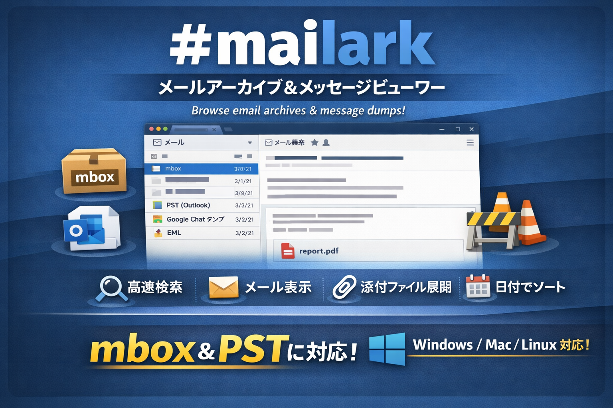

# mailark

<p align="center">
  
</p>

メールアーカイブ・メッセージダンプのデスクトップビューアー  
A desktop viewer for email archives and message dumps.

Thunderbirdなどのメールクライアントに頼らず、アーカイブファイルを開いて検索・閲覧できます。  
Browse, search, and sort through mail archives and exported message data — without fighting your email client.

---

## 対応フォーマット / Supported Formats

| フォーマット | 状態 |
|------------|------|
| mbox | ✅ 対応済み |
| PST (Outlook) | ✅ 対応済み |
| Google Chat ダンプ | 🚧 開発予定 |
| EML | 🚧 開発予定 |

---

## 機能 / Features

- 📂 mboxファイルを開いて2ペインでメール一覧表示
- 📥 PST ファイルを開いて自動で mbox に変換して表示
- 🔍 差出人・件名・本文の横断フルテキスト検索
- ↕️ 日付でのソート
- 📎 添付ファイルの確認・展開
- 🌐 HTMLメールのサンドボックス表示
- 🔣 RFC2047エンコードされた件名（日本語など）のデコード対応
- 🌓 ダーク / ライトテーマの切り替え

---

## セットアップ / Getting Started

**必要なもの / Prerequisites:** Node.js 18+

```bash
git clone https://github.com/yourname/mailark.git
cd mailark
npm install
npm start
```

---

## 使い方 / Usage

1. `npm start` でアプリを起動
2. 右上の **「mboxを開く」** をクリック
3. mbox または PST ファイルを選択（拡張子なしファイルも可）
4. 左ペインのメール一覧からクリックして本文を表示
5. 上部の検索バーで差出人・件名・本文を絞り込み
6. 添付ファイルはチップをクリックで展開

### Thunderbirdのmboxファイルの場所

```
~/Library/Thunderbird/Profiles/xxxxxxxx.default/Mail/
```

---

## ロードマップ / Roadmap

- [x] PST形式の対応
- [ ] Google Chat JSONダンプの対応
- [ ] EML形式の対応
- [ ] 差出人・件名でのソート
- [ ] メール単体のエクスポート
- [x] ダーク / ライトテーマの切り替え

---

## コントリビュート / Contributing

PRはいつでも歓迎です。大きな変更は先にissueを立ててください。  
PRs welcome. Please open an issue first for large changes.

## リリース / Release

`main` にマージされると `tagpr` がリリース PR とタグ作成を管理し、タグが作成されたときだけ同じ workflow 内で macOS / Windows / Linux 向けビルドと GitHub Release 作成を実行します。

運用前に以下を設定してください。

- `Settings > Actions > General` で `Allow GitHub Actions to create and approve pull requests` を有効化

この構成では repository 標準の `GITHUB_TOKEN` を使って `tagpr` と release 作成を実行します。

## ライセンス / License

Apache-2.0
